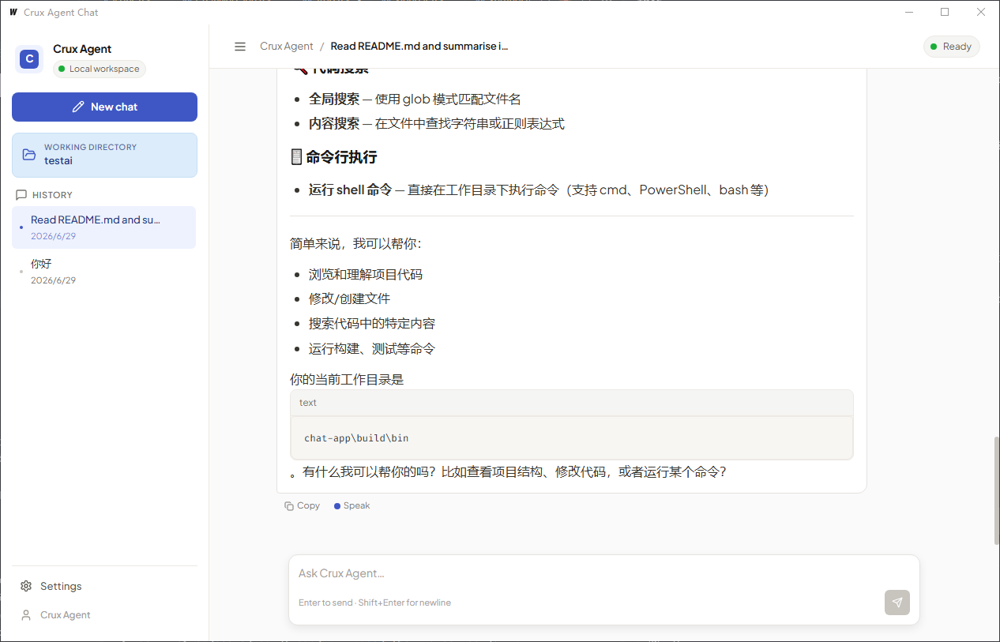
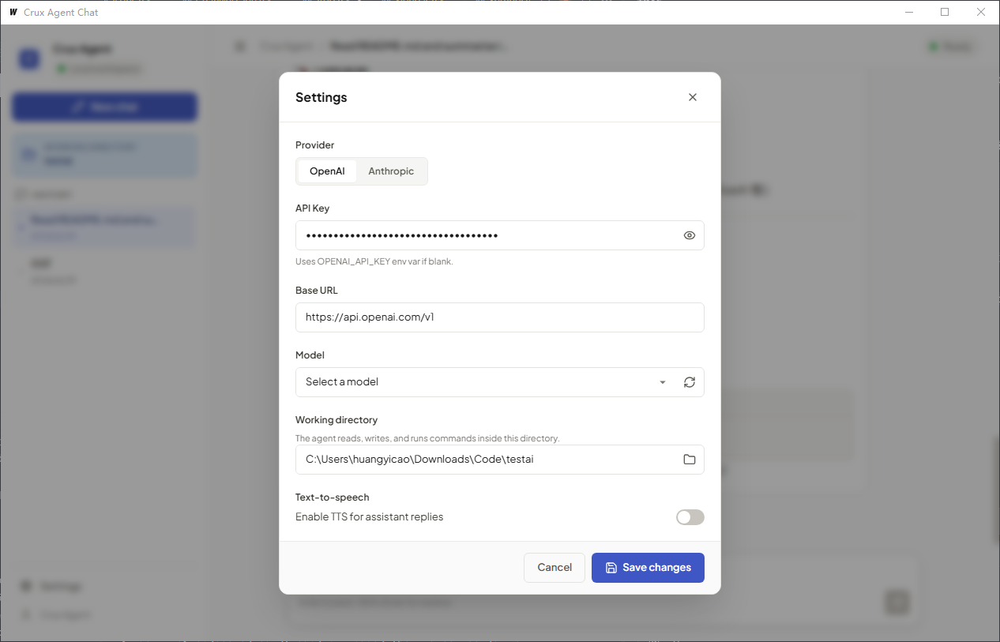

# Chat App

> A Wails-based AI chat desktop application with a React frontend,
> providing a ChatGPT-style interface with streaming responses,
> markdown rendering, and text-to-speech capabilities.



## Features

| | |
|---|---|
| **Streaming Responses** | Real-time streaming output from AI models with thinking/tool-call visibility. |
| **Markdown + LaTeX** | Full markdown rendering including code blocks with syntax highlighting and KaTeX math formulas. |
| **Text-to-Speech** | Manual play/stop audio playback of AI responses. |
| **Tool Calls** | Expandable/collapsible tool-call blocks showing arguments and results. |
| **Conversation History** | Persistent conversation history managed via the sidebar. |
| **Sidebar** | Collapsible sidebar with conversation list and settings. |

## Screenshots

### Conversation view


*Agent conversations with streaming responses, tool calls and thinking content.*

### Settings panel



*Configuration panel for API key, provider selection (OpenAI / Anthropic),
base URL, and model.*

## Configuration

1. Open the settings panel (gear icon in sidebar)
2. Configure:
   - Provider: OpenAI or Anthropic
   - API Key: Your API key
   - Base URL: The API endpoint URL
   - Model: Select a model from the dropdown or enter manually

Settings are persisted automatically to `%APPDATA%/crux-agent/settings.json`
on Windows, or the equivalent OS config directory on macOS/Linux.

## Live Development

```bash
cd chat-app
wails dev
```

This will run a Vite development server with hot reload for frontend changes.
A browser dev server is also available at http://localhost:34115.

## Building

```bash
cd chat-app
wails build
```

Builds a redistributable, production-mode package.

## Technology Stack

| Technology | Purpose |
|---|---|
| **Wails v2** | Cross-platform desktop app framework |
| **React 18** | Frontend UI framework |
| **TypeScript** | Type-safe development |
| **TailwindCSS 3** | CSS framework |
| **Lucide React** | Icon library |
| **React Markdown** | Markdown rendering |
| **react-syntax-highlighter** | Code syntax highlighting |
| **KaTeX** | Math formula rendering |
| **modernc.org/sqlite** | Session storage (pure Go, no CGo) |
