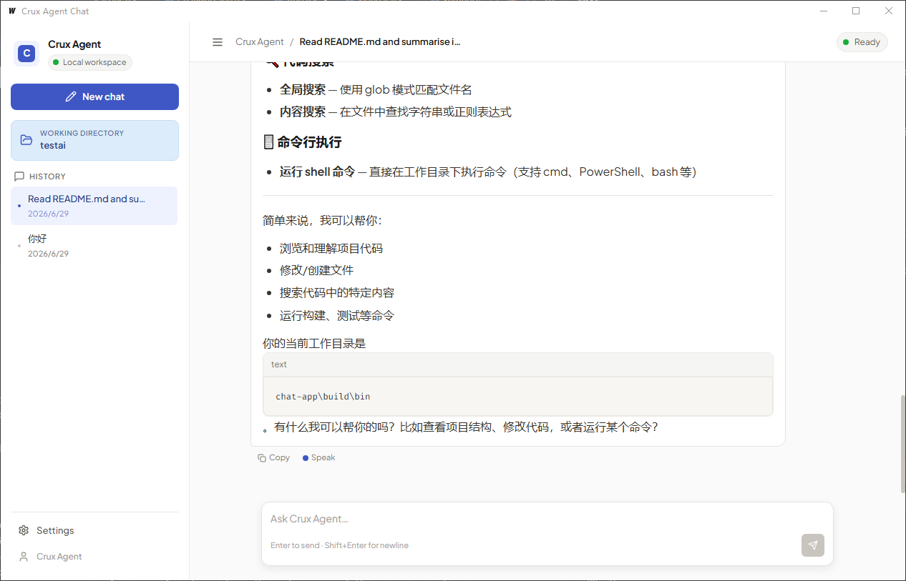

# Chat App

> 一个基于 **Wails v2** + **React** 的 AI 桌面聊天应用，提供 ChatGPT 风格界面，
> 支持流式响应、思维链/工具调用可视化、Markdown 渲染、文件浏览/预览、语音朗读，
> 以及 **agent-engine**（核心 Agent 循环）和 **crux-plugin**（子进程插件）的深度集成。



---

## 目录

- [功能特性](#功能特性)
- [架构概览](#架构概览)
- [工具系统](#工具系统)
- [插件（crux-plugin）](#插件crux-plugin)
- [数据存储位置](#数据存储位置)
- [配置](#配置)
- [开发环境](#开发环境)
- [构建](#构建)
- [项目结构](#项目结构)
- [技术栈](#技术栈)

---

## 功能特性

| 类别 | 说明 |
|------|------|
| **流式响应** | 实时流式输出，含思维链（thinking）与工具调用过程的可视化。 |
| **Markdown + LaTeX** | 完整 Markdown 渲染，支持代码块高亮与 KaTeX 数学公式。 |
| **工具调用** | 可展开/折叠的工具调用块，展示参数与执行结果。 |
| **语音朗读（TTS）** | 基于浏览器 Web Speech API，手动播放 / 停止 AI 回复（支持多语言音色）。 |
| **对话历史** | 多会话持久化，侧边栏管理会话列表，切换会话自动恢复上下文。 |
| **文件浏览器** | 侧边栏文件树 + 文件预览面板，支持文本 / 图片 / Office（Word / Excel / PPT）/ PDF。 |
| **工作目录** | 所有文件与 Shell 相关工具默认在选定工作目录下运行。 |
| **内存（Memory）** | 跨会话长期记忆，`remember` / `recall` 工具读写，可手动增删查清。 |
| **技能（Skills）** | 从 `<工作目录>/skills` 加载 `SKILL.md` 作为技能工具，让 LLM 按规程执行任务。 |
| **自动学习（AutoLearn）** | 可选地从对话与用户输入中提取记忆并落盘。 |
| **上下文压缩** | agent-engine 内置 pre-call 压缩 + 溢出重试，避免超长上下文报错。 |
| **agent-engine 核心** | Agent 循环运行在 [`agent-engine`](../agent-engine) 上（可嵌入式 Go 引擎）。 |
| **crux-plugin 插件** | 子进程 JSON-RPC 插件（[`crux-plugin`](../crux-plugin)）在启动时发现，其工具并入 Agent 工具集。 |

---

## 架构概览

聊天应用把两个独立模块「粘合」到一起，作为单一桌面应用：

```
┌───────────────────────────────────────────────┐
│                   React 前端                    │
│   ChatArea · ChatInput · Thinking · ToolCall   │
│   FileTree · FilePreview · OfficeHtmlViewer   │
│   Settings · Sidebar · TTS                     │
└───────────────────┬───────────────────────────┘
                    │  Wails runtime (Events + 绑定方法)
┌───────────────────▼───────────────────────────┐
│                   Go 后端 (App)                 │
│                                                │
│   ┌────────────────────────────────────────┐   │
│   │   agent-engine (核心 Agent 循环)        │   │
│   │   engine.Agent · 事件流 · 工具执行      │   │
│   │   · 上下文压缩 · steering/follow-up     │   │
│   └───────────────────┬────────────────────┘   │
│                       │ 注入 []engine.AgentTool │
│   ┌───────────────────▼────────────────────┐   │
│   │         buildAllTools() → 工具集        │   │
│   │  ├─ 内置工具 (chat-app/tools)        │   │
│   │  ├─ crux-plugin 子进程工具 (适配)      │   │
│   │  ├─ 技能工具 (skillutil)               │   │
│   │  └─ 记忆工具 (remember/recall)         │   │
│   └───────────────────┬────────────────────┘   │
│                       │ ToolAdapter.Execute    │
│   ┌───────────────────▼────────────────────┐   │
│   │  crux-plugin Manager (子进程 JSON-RPC) │   │
│   │  发现/启动/停止 · tool.list · tool.exec│   │
│   └────────────────────────────────────────┘   │
└───────────────────────────────────────────────┘
```

**关键点**

- **核心循环来自 agent-engine**：`agent-engine/engine` 提供状态化 `Agent`、事件驱动流式处理、并行/串行工具执行、pre-call + overflow 上下文压缩。它取代了旧版 `crux-agent-runtime/agent` 的循环。
- **工具来源多样**：`buildAllTools()` 每轮汇合 内置工具 + 插件工具 + 技能工具 + 记忆工具，注入 `engine.Agent`。
- **适配层**：`crux-plugin.ToolAdapter` 通过薄适配（`ToolAdapter → engineToolPlugin → engine.AgentTool`）转成 agent-engine 可执行的工具，模式与 [`agent-engine/examples/crux-plugin-tool`](../agent-engine/examples/crux-plugin-tool) 完全一致。

---

## 工具系统

> 每次发送消息时，后端都会调用 `buildAllTools()` 重新构建工具集并注入 Agent，
> 因此新增/启停插件会在下一轮对话立即生效。

### 1. 内置工具（`chat-app/tools`）

跨平台（Windows / Linux / macOS），行为随当前操作系统自适应：

| 工具 | 说明 |
|------|------|
| `read_file` | 读取文件内容（可指定行范围） |
| `write_file` | 创建或覆盖文件 |
| `bash` | 执行 Shell 命令（Windows 用 PowerShell，Unix 用 sh） |
| `glob` | 按模式列出文件 |
| `grep` | 搜索文件内容 |
| `web_fetch` | 拉取 URL 并返回纯文本内容 |

所有内置工具都直接返回 agent-engine 的 `engine.AgentTool`，不再依赖 `crux-agent-runtime/tools` 的旧 `agent.AgentTool`（也省去了 `rtToolToEngine` 转换层），并会被 `wrapWithWorkingDir` 包装，使相对路径与 Shell 命令默认解析到当前工作目录。

### 2. 插件工具（`crux-plugin`）

见 [插件（crux-plugin）](#插件crux-plugin)。

### 3. 技能工具（`skillutil`）

加载 `<工作目录>/skills/<skill>/SKILL.md`（也内置一份 bundled 技能），
每个技能注册为 `skill_<name>` 工具；被调用时返回 SKILL.md 内容供 LLM 参考执行。
用户技能优先于内置 bundled 技能。

### 4. 记忆工具

- `remember` — 将 key=value 写入跨会话长期记忆并落盘。
- `recall` — 按 key 读取长期记忆。

---

## 插件（crux-plugin）

`crux-plugin` 是一个**子进程 JSON-RPC 2.0 插件框架**，每个插件运行在独立进程中，
与宿主通过 `initialize` / `tool.list` / `tool.execute` / `shutdown` 等方法通信。

### 插件发现目录

应用启动时从以下目录扫描 `plugin.json` 清单（缺失目录会被静默跳过）：

1. `<可执行文件目录>/plugins`
2. `~/.crux/plugins`

### plugin.json 示例（tool 插件）

```json
{
  "id": "my-plugin",
  "name": "My Plugin",
  "version": "1.0.0",
  "command": "./my-plugin-bin",
  "type": "tool",
  "capabilities": ["tool"],
  "description": "A sample tool plugin"
}
```

拥有 `capabilities: ["tool"]` 的插件启动后会通过 `tool.list` 上报工具集，
这些工具以 **`<pluginID>.<toolName>`** 命名（如 `my-plugin.get_weather`）暴露给 LLM，
每个工具调用都会向插件子进程发一次 `tool.execute` JSON-RPC。

### 特性说明

- **进程隔离**：插件崩溃不影响宿主；每个插件一个独立子进程。
- **生命周期**：随应用启动自动发现+启动，应用退出时优雅停止（5s 超时）。
- **并发安全**：`Process.Call` / `Notify` 均并发安全，可在多轮中并行调用。

详细协议见 [`crux-plugin/AGENTS.md`](../crux-plugin/AGENTS.md)。

---

## 数据存储位置

所有数据默认存放在系统用户配置目录下的 `crux-agent` 文件夹：

| 路径 | 内容 |
|------|------|
| `<configDir>/crux-agent/settings.json` | 应用设置（provider / API key / baseURL / model / 工作目录等） |
| `<configDir>/crux-agent/conversations.json` | 会话索引 |
| `<configDir>/crux-agent/conversations/<id>.json` | 每个会话的消息记录 |
| `<configDir>/crux-agent/memory.json` | 长期记忆（key=value） |
| `<configDir>/crux-agent/logs/<YYYY-MM-DD>.log` | 运行日志 |

> 在 Windows 上 `configDir` 为 `%APPDATA%`，macOS / Linux 为对应的用户配置目录。

---

## 配置

1. 点击侧边栏齿轮图标打开设置面板。
2. 配置：
   - **Provider**：OpenAI / Anthropic / Ollama（本地）
   - **API Key**：你的 API 密钥
   - **Base URL**：API 端点地址（已为各 provider 预填默认值）
   - **Model**：从下拉列表选择，或选择「custom」手动输入任意模型 ID
   - **Thinking Level**：推理强度（针对支持思考的模型）
3. 设置会自动持久化到 `settings.json`。

> Ollama 本地模型可填 `http://localhost:11434/v1`（OpenAI 兼容端点）。

---

## 开发环境

前置要求：[Go 1.25+](https://go.dev/dl/)、[Node.js](https://nodejs.org)、[Wails CLI](https://wails.io/docs/gettingstarted/installation)。

```bash
cd chat-app
wails dev
```

这会启动 Vite 开发服务器（前端热重载），浏览器可访问 http://localhost:34115。

> 本项目位于多模块 `go.work` 中，`agent-engine`、`crux-plugin`、`crux-ai` 通过 `replace`
> 指向仓库内目录，无需发布到公共仓库即可本地开发。

---

## 构建

```bash
cd chat-app
wails build
```

生成可分发的生产模式安装包（产物在 `build/bin`）。

---

## 项目结构

```
chat-app/
├── main.go               # 入口：Wails 应用启动/关闭、插件生命周期
├── app.go                # 后端核心：Agent 装配、工具汇集、事件转发、插件适配
├── llm.go                # LLM 摘要/同步总结（供 autolearn 与压缩使用）
├── storage.go            # 设置与会话的 JSON 持久化
├── ooxml.go              # Office（docx/xlsx/pptx/PDF）→ HTML 预览渲染
├── skillutil/            # 技能加载器（SKILL.md → agent 工具）
├── logutil/              # 日志工具
└── frontend/             # React + TypeScript 前端
    └── src/
        ├── App.tsx                    # 顶层布局 / 状态 / TTS
        └── components/
            ├── ChatArea.tsx           # 对话区
            ├── ChatInput.tsx          # 输入框
            ├── ChatMessage.tsx        # 单条消息
            ├── ThinkingBlock.tsx      # 思维链
            ├── ToolCallBlock.tsx      # 工具调用块
            ├── MarkdownRenderer.tsx   # Markdown + KaTeX 渲染
            ├── Sidebar.tsx            # 侧边栏（会话 + 设置入口 + 记忆/技能面板）
            ├── FileTreePanel.tsx      # 文件树
            ├── FilePreviewPanel.tsx   # 文件预览
            ├── OfficeHtmlViewer.tsx   # Office/PDF HTML 查看器
            └── SettingsPanel.tsx      # 设置面板
```

---

## 技术栈

| 技术 | 用途 |
|------|------|
| **Wails v2** | 跨平台桌面应用框架 |
| **agent-engine** | 核心 Agent 循环（事件流、工具执行、上下文压缩） |
| **crux-plugin** | 子进程 JSON-RPC 插件系统 |
| **crux-ai** | 统一 LLM Provider 抽象（Anthropic / OpenAI / Ollama 等） |
| **React 18 + TypeScript** | 前端 UI |
| **TailwindCSS 3** | 样式 |
| **Lucide React** | 图标库 |
| **React Markdown** | Markdown 渲染 |
| **react-syntax-highlighter** | 代码语法高亮 |
| **KaTeX** | 数学公式渲染 |
| **Web Speech API** | 语音朗读（TTS） |
| **JSON 文件存储** | 设置与会话持久化（`<configDir>/crux-agent`） |
